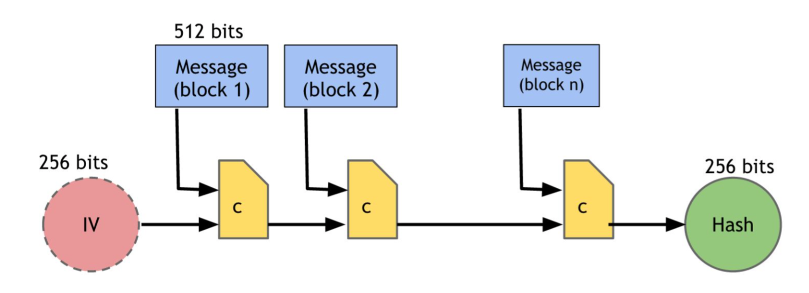
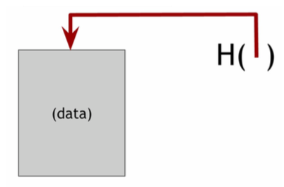
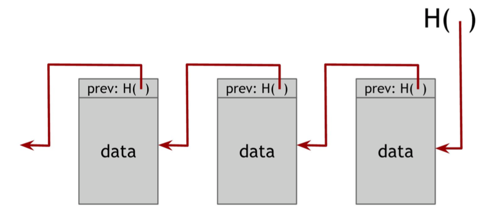
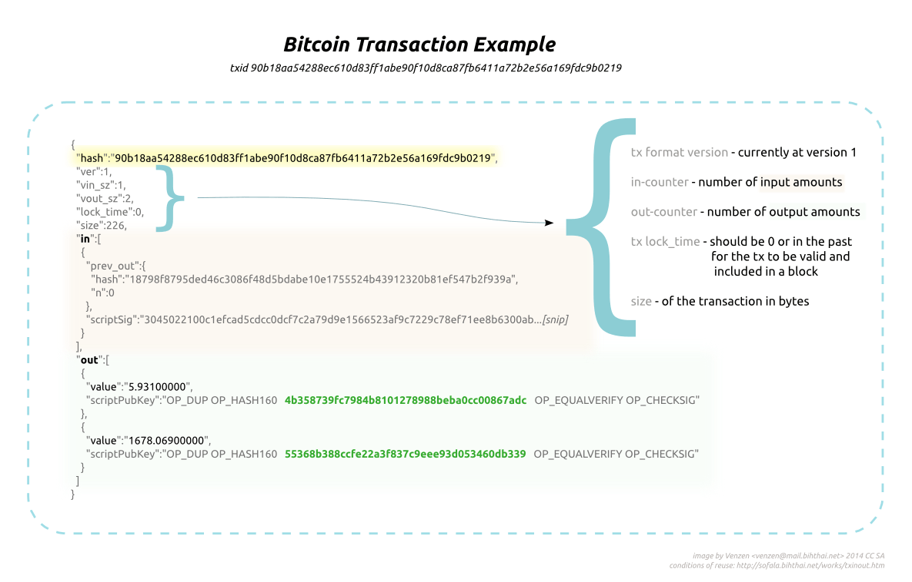

# *Week 2* Block Chain 

I got to know about Bitcoin in summer of 2012. The only impression of Bitcoin was that it was something cool. I paid attention to Bitcoin again in 2014 when its exchange rate to CNY was 1:1400. Despite knowing the bitcoin relatively earlier and attending some stupid forum about Bitcoin, I didn't understand it until this weekend with the help of a programmer's perspective.

## Brief
* Use public key and fancy encrpytion to solve anonymous
* Use block chain to solve owership transfering
* Use block chain with block containing more information to solve double spending

## Important API and Data Structure
* Hash :: Information -> 256Bits
  * "collision free"
    * It's really hard to find x and y such h(x) = h(y) and x != y
    * hash function is not injective because input size is infinite and output size is fixed
  * hiding
    * Given h(x), it is infeasible to find x only if input is random enough and big enough.
    * Improve Hidability (if size of possible input is too small) by choosing a r from a probability distribution that
      has high min-entropy (high min-entropy means very spread out)
        * E.x Given h(r | x), it is infeasible to find x
  * puzzle friendly
    * Given a "puzzle ID" id (from high min-entropy distrib), and a target set Y, Try to find x such that h(id | x) = Y
      * Puzzle friendly -> no solving strategy is much better than trying random values of x.
* Commitment API
  ```
  (key, com) := commit(msg)
  match := verify(com, key, msg)

  commit(msg) := (h(key | msg), key) where key is a random 256-bit value
  verify(com, key, msg) := h(key | msg) == com
  ```
* SHA-256

* Hash Pointer
  ```c
  struct HashPointer
  {
    struct info *p_info;
    hash h_info;
  };
  ```
  

  
* Signature API
  ```
  (sk, pk) := generateKeys(keysize)
  sig := sign(sk, message)
  isVliad := verify(pk, message, sig)
  ```
  * "valid signatures verify"
    * verify(pk, message, sign(sk, message)) == true
  * "can't forge signature"
    * can't produce a verfiable signature on another message given any set of messages and corresponding signature
  * In practice, use h(message) instead of message (smaller size)

## Definition

* Block Chain
  * The underlying structure of block chain is a linked "list" connected by hash pointer
  * It's used to verify a transaction and store the verified transaction
  * To add a new block in a naive block chain is accomplished by appending a new hash pointer whose hash is
    the signature and p_info is pointer to the original block chain.
  * It's hard to tamper to data because Anyone can always use hash to verify. Not only is deep tampering required, but also tampering the newly created data is necessary.
* BitCoin Transaction

  * A Bitcoin transaction is a signed piece of data that is broadcast to the network and, if valid, ends up in a block in the blockchain.
  * One input(One consumed unit) maps to One signature
  * UTXO
    * is an abbreviation for Unspent Transaction Output, also referred to as an “output”
  * Inputs must be in previous UTXO
* A Transactio is valid iff
  * consumed coins valid
  * not already consumed
  * total value out = total value in
  * signed by owners of all consumed coins

## FAQ

1. What if the block chain is too big?
  * A block header with no transactions would be about 80 bytes. If we suppose blocks are
generated every 10 minutes, 80 bytes * 6 * 24 * 365 = 4.2MB per year. With computer systems
typically selling with 2GB of RAM as of 2008, and Moore's Law predicting current growth of
1.2GB per year, storage should not be a problem even if the block headers must be kept in
memory.
